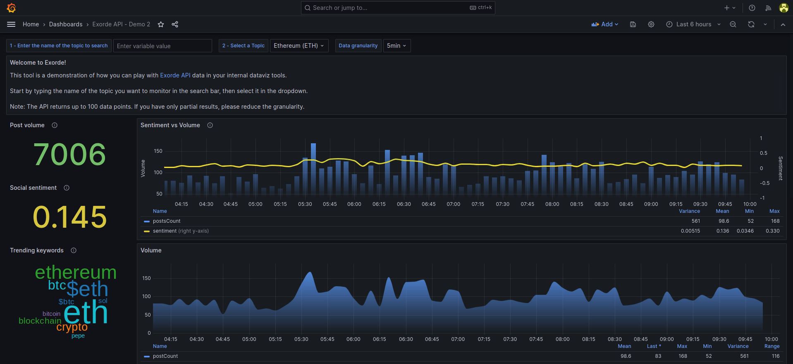

# Grafana demo dashboard

This dashboard is a demonstration of how you can play with [Exorde API](https://docs.exorde.io/) data in your internal dataviz tools. You can use it as a starting point to build your own dashboard or to explore Exorde API data.

With this dashboard, you can monitor the sentiment, the volume and trending keywords related to any topic tracked by Exorde. Just type the name of the topic you want to monitor in the search bar, then select it in the dropdown.



## Installation instructions

### Access the Exorde API

First, to use the Exorde API, you need to create an account on [Exorde developers portal](https://developers.exorde.io/sign-up). You'll get 1000 free credits and an API generated on your first login. Keep it safe, you'll need it to authenticate your requests.

### Run Grafana locally

If you don't have a Grafana instance, you can run one locally using a [docker container](https://grafana.com/docs/grafana/latest/setup-grafana/installation/docker/), listening on port 3000:

```bash
docker run -d -p 3000:3000 \
  --name=grafana-exorde-demo \
  --env GF_INSTALL_PLUGINS=magnesium-wordcloud-panel,marcusolsson-json-datasource \
  grafana/grafana
```

Grafana is available at [http://localhost:3000](http://localhost:3000). The default username and password are both `admin`.

**Note**: If you already have a Grafana instance, ensure that the [Word cloud](https://grafana.com/grafana/plugins/magnesium-wordcloud-panel/) and [JSON API
](marcusolsson-json-datasource) plugins are installed.

### Connect Grafana to the Exorde API

Add a [JSON API](https://grafana.com/grafana/plugins/marcusolsson-json-datasource/) connector, to enable Grafana to query the Exorde API:

1. Go to `Main menu` > `Connections` > `Data sources`.
2. Click on `Add data source`.
3. Type `JSON API` in the search bar.
4. Click on `JSON API` data source.
5. Fill the form:

   - **Name**: `Exorde API`
   - **URL**: `https://api.exorde.io`
   - **Authentication**: `No Authentication`
   - **HTTP Headers**: add the following headers:
     - `Accept`: `application/json`
     - `X-Exorde-Api-Version`: `v1`
     - `Authorization`: `Bearer <YOUR_API_KEY>`

Click on `Save & Test` to validate the connection.

## Import the dashboard

To import the dashboard:

1. Copy the content of the dashboard at https://raw.githubusercontent.com/exorde-labs/product-demo/main/grafana/dashboard.json.
2. Go to `Main menu` > `Dashboards` > `New` > `Import`.
3. Paste the content of the dashboard in the `Import via dashboard JSON model` field.
4. Click on `Load`.
5. Select the `Exorde API` data source.
6. Click on `Import`.

## How to use the dashboard

Start by typing the name of the topic you want to monitor in the search bar, then select it in the dropdown.

**Note**: The API returns up to 100 data points. If you have only partial results, please reduce the granularity.
